# **Faculty Management System**
### **Overview**
The **Faculty Management System** is a comprehensive platform built to streamline university operations by automating administrative, academic, and student activities. It leverages modern technologies such as facial recognition for login and attendance and supports role-based functionalities for students, professors, and affairs staff.

The system is developed using **.NET Core MVC** to provide a robust, maintainable, and scalable web application.

---

### **Key Features**
- **Facial Recognition Integration**:
  - Login and attendance via face recognition for students and professors.
  - Traditional login (username and password) is also supported.
  
- **Role-Based Access**:
  - **Students**:
    - View personal information, enrolled courses, and available lectures.
  - **Professors**:
    - Add lectures, create assignments, and manage attendance.
  - **Affairs Staff**:
    - Manage users, courses, and professors with CRUD operations.
  
- **Responsive Design**:
  - Optimized for desktop and mobile devices.

- **User-Friendly Interface**:
  - Easy navigation with clean and modern UI design.

---

### **Technologies Used**

#### **Frontend**
- **HTML5** & **CSS3**: To structure and style the web pages.
- **Bootstrap**: For creating responsive and visually appealing layouts.
- **JavaScript**: For handling dynamic and interactive elements.
- **Face Recognition Integration**: Built with JavaScript libraries to enable seamless facial detection and authentication.

#### **Backend**
- **.NET Core MVC**:
  - Used to build the application’s structure, logic, and views.
  - Ensures smooth interaction between frontend and backend.
- **Entity Framework Core**: To manage database operations and handle ORM (Object Relational Mapping).

#### **Database**
- **SQL Server**: Used for storing and managing data, including user information, courses, lectures, and attendance records.

#### **Version Control**
- **Git** & **GitHub**: For source code management and collaboration.

---

### **Screenshots**

#### Homepage
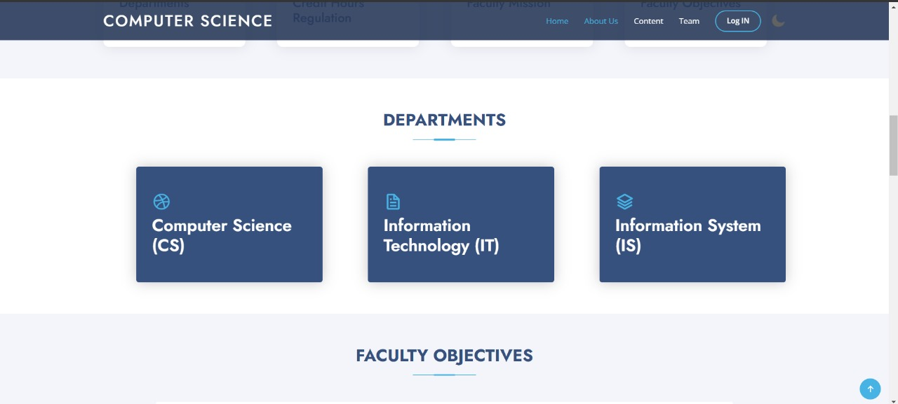

#### Login
- **Username & Password**  
  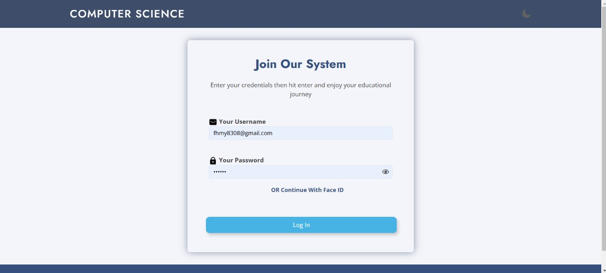  
- **Facial Recognition**  
  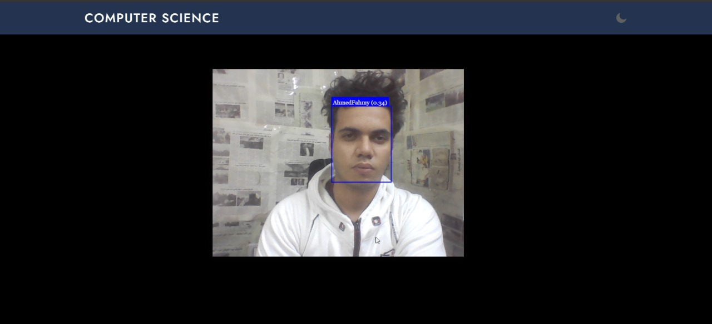  

#### Student Dashboard
- **Personal Information**  
  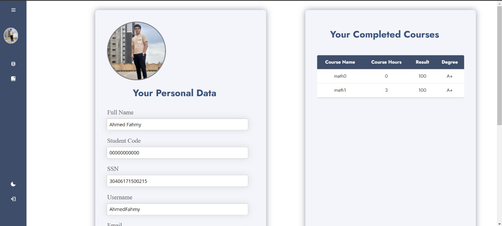  
- **Courses**  
  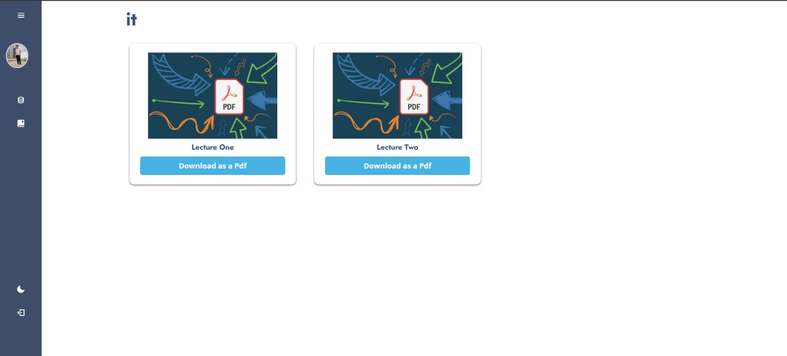  
- **Lectures**  
  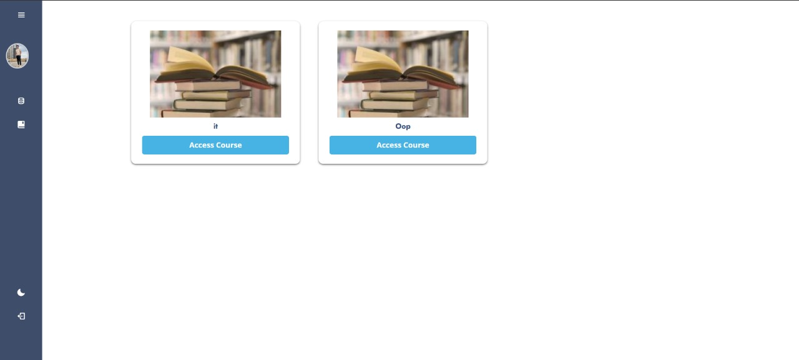  

#### Professor Dashboard
- **Professor Overview**  
  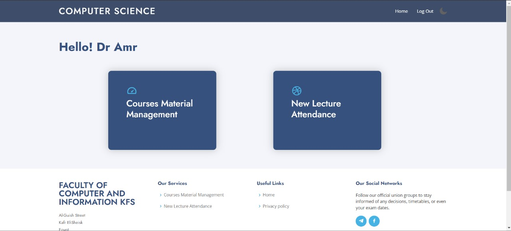  
- **Take Attendance Using FaceID**  
  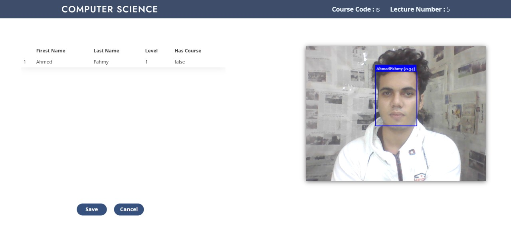  
- **Courses Management**  
  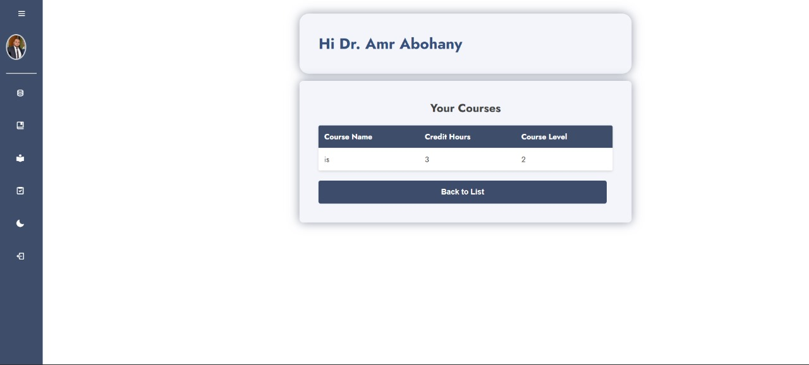  
- **Add Lecture**  
  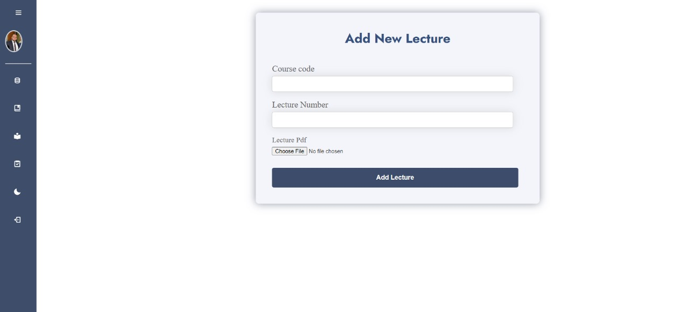  
- **Add Assignment**  
  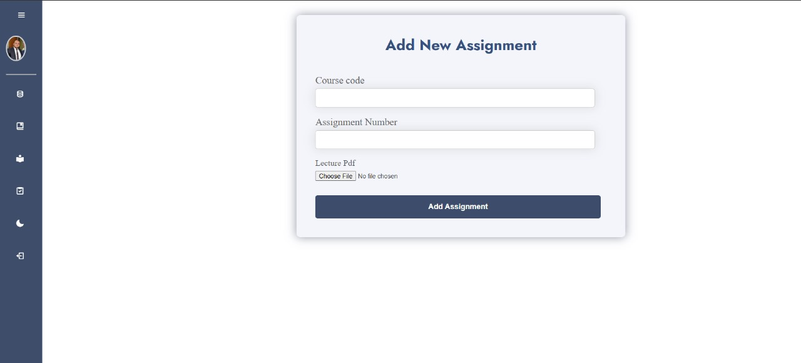  

#### Affairs Dashboard
- **Affairs Overview**  
  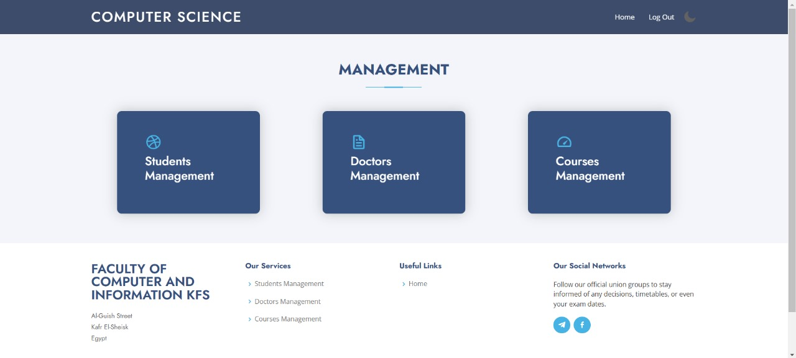  
- **Add Professor**  
  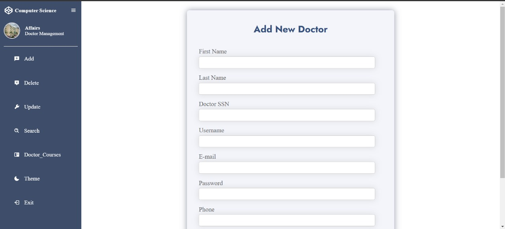  
- **Search for Professor's Courses**  
  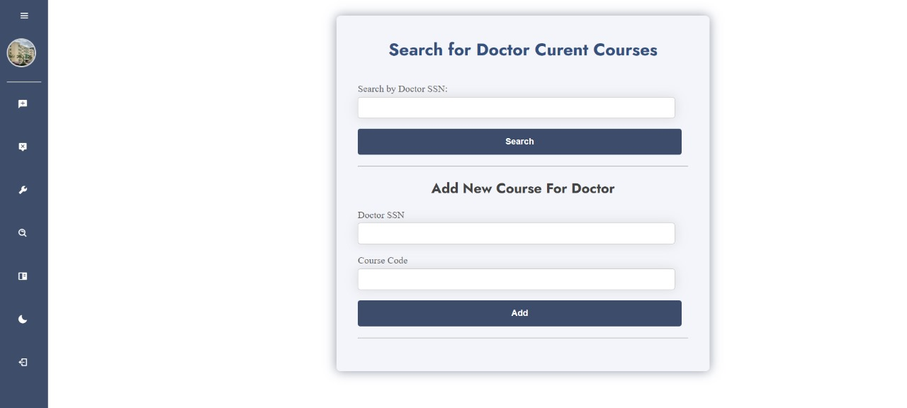  
- **Search for Students**  
  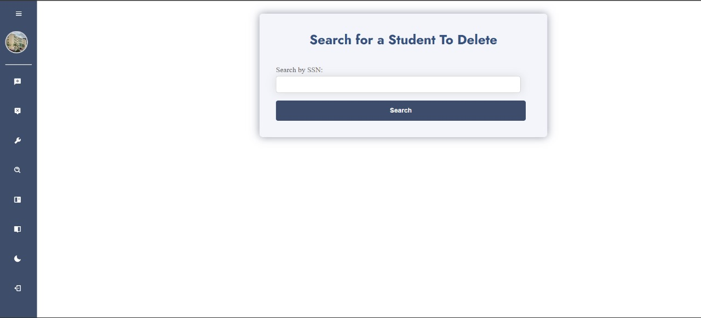  
- **Add New Course**  
  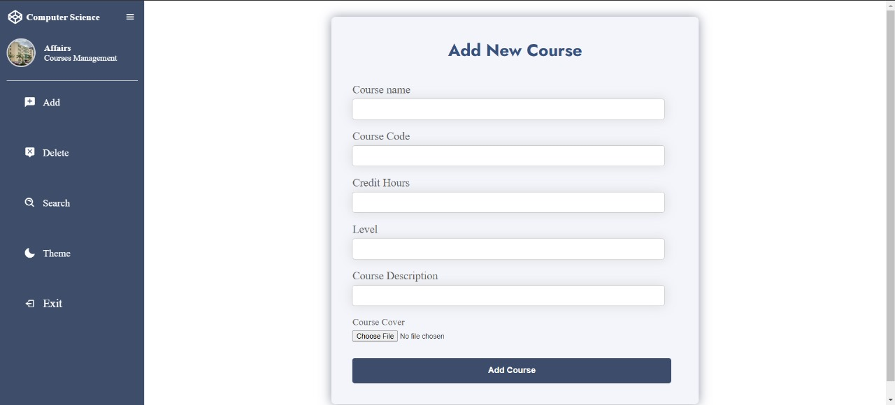  


---

### **How the System Works**

1. **Students**:
   - Students log in using either their username/password or facial recognition.
   - Once logged in, they can view their personal information, enrolled courses, and upcoming lectures.

2. **Professors**:
   - Professors log in with their credentials or facial recognition.
   - They can create new lectures, add assignments, and manage attendance for their courses.
   - Attendance is taken using a facial recognition system to ensure accuracy.

3. **Affairs Staff**:
   - Affairs staff have complete control over the system and can:
     - Add, delete, or modify student, professor, and course data.
     - Search for specific records to retrieve detailed information.

---

### **Setup Instructions**

1. **Clone the Repository**:
   ```bash
   git clone https://github.com/yourusername/university-management-system.git
   cd university-management-system
